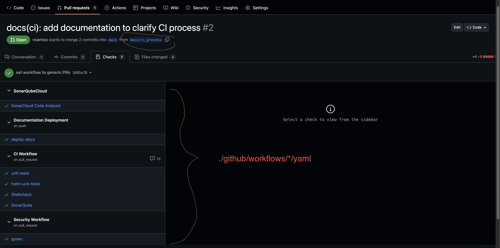

# Running your CI locally

If you want to simply run every static tests to your repository, you can type the following command `make test`.

```shell
make test
```

This command will run the following tests:

* `staticcheck`
    * Static analysis for Go
* `gotest`
    * Unit testing for Go
* `shellcheck`
    * Lint for shellscripts
* `helm-unittest`
    * Unit test for local chart's manifests generation

# Running your CI remotely

Using Github actions, all tests for CI will run automatically to branch `main` or for every pull requests with any of those prefixes as it's branch:

- `feat/*`
- `docs/*`
- `break/*`
- `fix/*`

{ align="center" }
