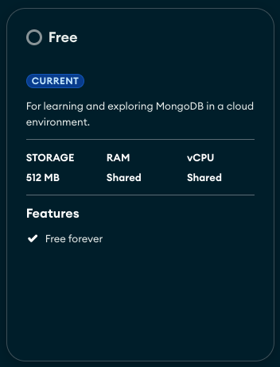

# Getting started

This guide will help you to: build, run and observe `budget-tracker-api` locally for development purposes.

## Requisites

- [X] Operational System
    * [X] Linux
    * [X] Unix (MacOS)
    * [ ] Windows
- [x] Binaries and requisites needed
    * [X] Docker Desktop / Rancher Desktop
    * [X] `docker` and `docker-compose` binaries
    * [X] make (for `Makefile` usage)
    * [X] git
    * [X] curl (for local testing)
    * [X] Python 3.x
    * [X] Golang 1.25+
    * [X] staticcheck
    * [X] shellcheck
- [ ] Kubernetes local requisites
    * [ ] [`kind`](https://kind.sigs.k8s.io/)
    * [ ] `kubectl`
    * [ ] `kubectx`
    * [ ] `helm` `v3+`
    * [ ] [`helm-unittest`](https://github.com/helm-unittest/helm-unittest)
    * [ ] [`helm-docs`](https://github.com/norwoodj/helm-docs)
- [X] External requisites
    * [X] Github setup - for [Github actions](https://github.com/features/actions) usage
- [ ] Mongo's External requisites
    * [ ] [MongoDB Atlas database](https://www.mongodb.com/cloud/atlas/register) - (Optional)
    * [ ] `mongosh` (Optional)
    * [ ] [MongoDB Compass](https://www.mongodb.com/products/tools/compass)

### Fetching the code

First things first, ensure you have the latest code-base fetched:
 
```
# Feel free to use SSH instead of HTTPS
git clone https://github.com/vsantos/budget-tracker-api-v2
```

This command will create a local directory called `budget-tracker-api-v2` with the source code within.


### Setting up an external MongoDB (Optional)

If you don't want to run a local MongoDB instance, you can use Atlas' one since they offer a free-tier. You will endup having a mongodb instance along with credentials, make sure you are able to access before you pointing the app to it.

{ align="center" }

You can achieve this goal by either running [MongoDB Compass](https://www.mongodb.com/products/tools/compass) or MongoDB CLI `mongosh`.

<script src="https://giscus.app/client.js"
        data-repo="vsantos/budget-tracker-api-v2-discussions"
        data-repo-id="R_kgDOQApX1g"
        data-category="General"
        data-category-id="DIC_kwDOQApX1s4CwhAe"
        data-mapping="pathname"
        data-strict="0"
        data-reactions-enabled="1"
        data-emit-metadata="0"
        data-input-position="top"
        data-theme="catppuccin_frappe"
        data-lang="en"
        crossorigin="anonymous"
        async>
</script>