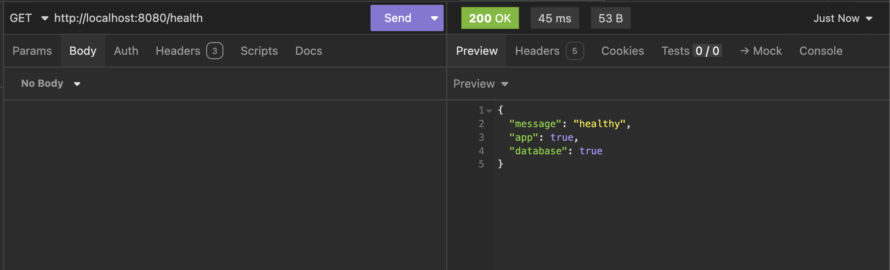
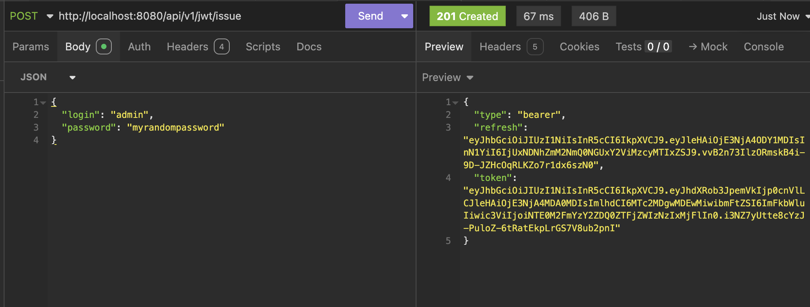

# Running the code within a local Kubernetes cluster

In this section, let's explore how you can run the platform locally using a Kubernetes cluster.

!!! Tip "Recommended"
    Personally, I do recommend using this method at least once before you commit your changes. Developing without k8s it will be faster but training kubernetes' mechanisms is a must nowadays. Also, we will validate it's charts as well.

There are many ways of creating a local kubernetes cluster: `kind`, `minikube`, `k3s`, etc. For the sake of simplity, we recommend the usage of `kind`, the only requisite is to have a container engine installed; since `kind` creates a kubernetes cluster by bootstraping containers.

## Create a local k8s cluster

By running the following `kind` command, you will create a functional k8s cluster named `budget-tracker-cluster`:

=== "Shell"
  ```shell
  kind create cluster --name budget-tracker-cluster
  ```

=== "Shell output"
  ```shell
  Creating cluster "budget-tracker-cluster" ...
  ✓ Ensuring node image (kindest/node:v1.34.0) 🖼
  ✓ Preparing nodes 📦
  ✓ Writing configuration 📜
  ✓ Starting control-plane 🕹️
  ✓ Installing CNI 🔌
  ✓ Installing StorageClass 💾
  Set kubectl context to "kind-budget-tracker-cluster"
  You can now use your cluster with:

  kubectl cluster-info --context kind-budget-tracker-cluster

  Not sure what to do next? 😅  Check out https://kind.sigs.k8s.io/docs/user/quick-start/
  ```

---

A local cluster using the current latest k8s' version was created and be accessed through it's local API server. You can run simply a `kubectl` command to validate clusters' health:


=== "Shell"
  ```shell
  kind cluster-info --context kind-budget-tracker-cluster
  ```
=== "Shell output"
  ```shell
  kubectl cluster-info
  Kubernetes control plane is running at https://127.0.0.1:50789
  CoreDNS is running at https://127.0.0.1:50789/api/v1/namespaces/kube-system/services/kube-dns:dns/proxy

  To further debug and diagnose cluster problems, use 'kubectl cluster-info dump'.
  ```

!!! success "All set!"
    If you are able to reach your local k8s cluster, you can proceed by deployment the app to k8s.

### Build your local's container image

To actually deploy some app in k8s, you will need a container image. Since there is an existent `Dockerfile` at the root of your directory, you can simply build a local image containing your local changes. The suggestion is to name your image as `budget-tracker-api:local` for the sake of tutorial but once you master the process, feel free to use your own process/name/tags/etc.

=== "Shell"
    ```shell
    # You can either use the manual command
    ## `docker build . -t budget-tracker-api:local`
    ## or with the abstraction `make static-docker-build`
    make static-docker-build
    ```
=== "Shell output"
    ```shell
    docker build . -t budget-tracker-api:local
    [+] Building 7.1s (18/18) FINISHED                                                                                                                       docker:desktop-linux
    => [internal] load build definition from Dockerfile                                                                                                                     0.0s
    => => transferring dockerfile: 447B                                                                                                                                     0.0s
    => [internal] load metadata for gcr.io/distroless/base-debian10:latest                                                                                                  1.4s
    => [internal] load metadata for docker.io/library/golang:1.25-alpine                                                                                                    1.4s
    => [auth] library/golang:pull token for registry-1.docker.io                                                                                                            0.0s
    => [internal] load .dockerignore                                                                                                                                        0.0s
    => => transferring context: 2B                                                                                                                                          0.0s
    => [builder 1/7] FROM docker.io/library/golang:1.25-alpine@sha256:ecb803821dbac0983b03a516adb8407b7dbadfb8771434dc5162a7c471dd27a2                                      0.0s
    => => resolve docker.io/library/golang:1.25-alpine@sha256:ecb803821dbac0983b03a516adb8407b7dbadfb8771434dc5162a7c471dd27a2                                              0.0s
    => [stage-1 1/4] FROM gcr.io/distroless/base-debian10:latest@sha256:101798a3b76599762d3528635113f0466dc9655ecba82e8e33d410e2bf5cd319                                    0.0s
    => => resolve gcr.io/distroless/base-debian10:latest@sha256:101798a3b76599762d3528635113f0466dc9655ecba82e8e33d410e2bf5cd319                                            0.0s
    => [internal] load build context                                                                                                                                        0.1s
    => => transferring context: 192.00kB                                                                                                                                    0.1s
    => CACHED [builder 2/7] RUN apk add --no-cache git ca-certificates                                                                                                      0.0s
    => CACHED [builder 3/7] WORKDIR /app                                                                                                                                    0.0s
    => CACHED [builder 4/7] COPY go.mod go.sum ./                                                                                                                           0.0s
    => CACHED [builder 5/7] RUN go mod download                                                                                                                             0.0s
    => [builder 6/7] COPY . .                                                                                                                                               0.2s
    => [builder 7/7] RUN CGO_ENABLED=0 GOOS=linux go build -o budget-tracker-api-v2 .                                                                                       4.8s
    => CACHED [stage-1 2/4] WORKDIR /app                                                                                                                                    0.0s
    => CACHED [stage-1 3/4] COPY --from=builder /app/swagger ./swagger/                                                                                                     0.0s
    => [stage-1 4/4] COPY --from=builder /app/budget-tracker-api-v2 .                                                                                                       0.0s
    => exporting to image                                                                                                                                                   0.5s
    => => exporting layers                                                                                                                                                  0.4s
    => => exporting manifest sha256:a9f0b6561601825e76aeee128dcc4e349c0c17e06db981e25add21838026bc8b                                                                        0.0s
    => => exporting config sha256:df60031fc931fdb2c36cdbaf5f23422efb9e3a4af99fcb2fdd954ef04492406d                                                                          0.0s
    => => exporting attestation manifest sha256:a6979f79f320c577abc68a2000678a4a6ce712e7dbaf886f2415402f28eb923d                                                            0.0s
    => => exporting manifest list sha256:c1a90d916a673f2ba911be810d0fadaa2ff071f35f6125fd520e4a16ebc09e56                                                                   0.0s
    => => naming to docker.io/library/budget-tracker-api:local                                                                                                              0.0s
    => => unpacking to docker.io/library/budget-tracker-api:local                                                                                                           0.1s
    ```

### Load your newest image to your local k8s cluster

=== "Shell"
    ```shell
    # the `--name` flag is to refer the cluster name you created previously through `kind` command
    kind load docker-image budget-tracker-api:local --name budget-tracker-cluster
    ```
=== "Shell Output"
    ```
    Image: "budget-tracker-api:local" with ID "sha256:6bff76bdd6a32204c80eb37f758083c715fcf21e2b6db8d86bc73af229d9ae04" not yet present on node "budget-tracker-cluster-control-plane", loading...
    ```

## Deploying the app through a helm chart

!!! Warning "No external dependencies"
    This method will only deploy `budget-tracker-api` itself to k8s and no other dependencies such as: jaeger or a k8s' version of mongoDB.

### Blindly

If you already built your image with the default suggested name, you can simply use the `make` command to generate all chart's manifests and apply them to your local k8s cluster through `demo` namespace:

=== "Shell"
    ```shell
    make k8s-apply
    ```
=== "Shell output"
    ```shell
    namespace/demo created
    secret/mongodb-credentials created
    service/local-dev-budget-tracker-api created
    deployment.apps/local-dev-budget-tracker-api created
    ```

### Inspect your manifests before applying them

If you want to inspect your manifests, especially when developing features to it's chart, you can run the following command:

```shell
helm template --release-name local-dev ./helm > manifests.yaml

cat manifests.yaml
```

Once you are satisfied with them, simply apply it:

```shell
kubectl apply -f manifests.yaml -n demo
```

### Checking the status of deployment

If you inspect your pods, you will see both replicas will be throwing error. Why is that? We set a static secret with dummy credentials, is not pointing to any MongoDB's instance:

=== "Shell"
    ```shell
    kubectl get pods -n demo
    ```
=== "Shell outcome"
    ```shell
    NAME                                            READY   STATUS   RESTARTS     AGE
    local-dev-budget-tracker-api-6675886dd7-6s8wl   0/1     Error    1 (1s ago)   2s
    local-dev-budget-tracker-api-6675886dd7-v7gp8   0/1     Error    1 (1s ago)   2s
    ```

---

Let's validate the logs of one of those:
=== "Shell"
    ```shell
    kubectl logs local-dev-budget-tracker-api-6675886dd7-6s8wl -n demo
    ```
=== "Shell outcome"
    ```shell
    mongodb+srv://mongodb-atlas-example.mongodb.net/
    {"level":"fatal","msg":"error parsing uri: lookup _mongodb._tcp.mongodb-atlas-example.mongodb.net on 10.96.0.10:53: no such host","time":"2025-10-14T17:47:03Z"}
    ```

Indeed, there is no such host `mongodb-atlas-example.mongodb.net` created. You must change your credentials within your Kubernetes to match your correct MongoDB's credentials.

=== "Shell"
    ```shell
    kubectl get secret -n demo mongodb-credentials -o yaml
    ```
=== "Shell outcome"
    ```shell
    apiVersion: v1
    data:
      host: bW9uZ29kYitzcnY6Ly9tb25nb2RiLWF0bGFzLWV4YW1wbGUubW9uZ29kYi5uZXQv
      password: ZXhhbXBsZQ==
      username: cm9vdA==
    kind: Secret
    metadata:
      name: mongodb-credentials
      namespace: demo
    type: Opaque
    ```

Use your favorite method to edit this file.

### Working with a mongoDB installed within k8s as well

If you prefer to install mongoDB as a kubernetes application as well instead of using the Mongo Atlas version, you can do it.

Go to your `values.yaml` and enable mongodb's integration by setting the following property as `true`:

```yaml
mongodb:
  enabled: true
```

Once true, if you generate all manifests through `make k8s-apply` the mongoDB dependency will be installed in `default` namespace.

A sidecar will be injected automatically to insert the initial user, similar approach used during [Running locally with containers](run_with_containers.md)

You can also validate through the logs if the user was injected successfuly:

=== "Shell"
    ```shell
    kubectl get pods -n default
    ```
=== "Shell output"
    ```shell
    NAME                                READY   STATUS    RESTARTS   AGE
    local-dev-mongodb-7dc8b8474-x9bpn   2/2     Running   0          3h21m
    ```

---

=== "Shell"
    ```shell
    kubectl logs local-dev-mongodb-7dc8b8474-x9bpn -c seed-data
    ```
=== "Shell output"
    ```shell
    Waiting for MongoDB to start...
    Injecting initial user data...
    2025-10-14T21:59:18.728+0000	connected to: mongodb://local-dev-mongodb:27017/
    2025-10-14T21:59:18.738+0000	1 document(s) imported successfully. 0 document(s) failed to import.
    Done seeding, sleeping forever...
    ```

!!! Warning "Credentials"
    Be aware that for the sake of testing, local mongoDB will be created with default credentials. Feel free to change it locally to a one on your one as a good practice.

---

!!! Success "Milestone reached"
    Congrats! You pass throught a lot of steps to run such containers within a k8s cluster. The next section will be about validating with some valid requests.

### Validating `budget-tracker-api` API rest

With every pod up and running, you are now able to test your REST API. With Kubernetes, there are many ways to expose your app but for the sake of local-development, we will rely on port-forward to it:

=== "Shell"
  ```shell
  kubectl port-forward svc/local-dev-budget-tracker-api 8080:8080 -n demo
  ```
=== "Shell output"
  ```shell
  Forwarding from 127.0.0.1:8080 -> 8080
  Forwarding from [::1]:8080 -> 8080
  Handling connection for 8080
  ```

This command will use the default settings of port `8080` and namespace `demo` to allow you to reach a certain k8s service, locally.

With any client (`curl`, Insomnia, etc), perform a simple request to `/health` from your local machine.

{ align="center" }

Let's test a token generation with a `POST` request, based on the mongodb credentials:

{ align="center" }

---

<script src="https://giscus.app/client.js"
        data-repo="vsantos/budget-tracker-api-v2-discussions"
        data-repo-id="R_kgDOQApX1g"
        data-category="General"
        data-category-id="DIC_kwDOQApX1s4CwhAe"
        data-mapping="pathname"
        data-strict="0"
        data-reactions-enabled="1"
        data-emit-metadata="0"
        data-input-position="top"
        data-theme="catppuccin_frappe"
        data-lang="en"
        crossorigin="anonymous"
        async>
</script>