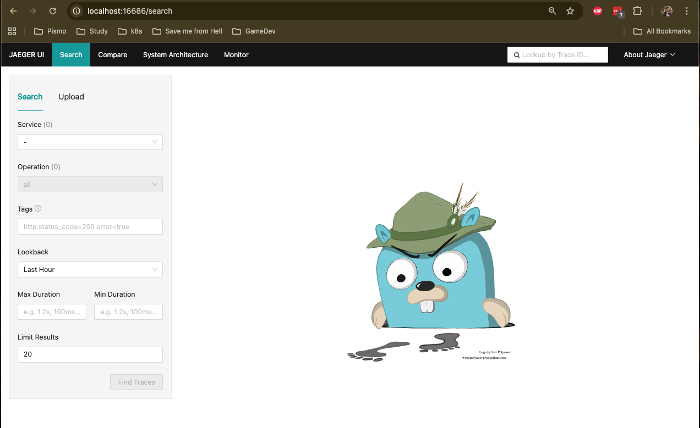
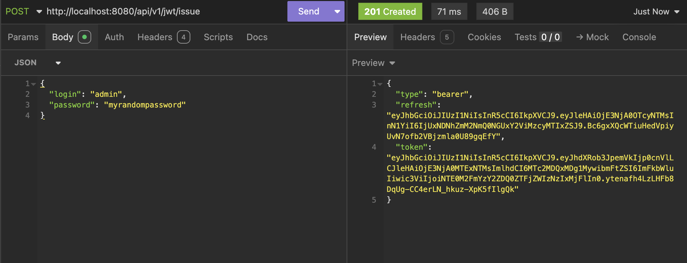
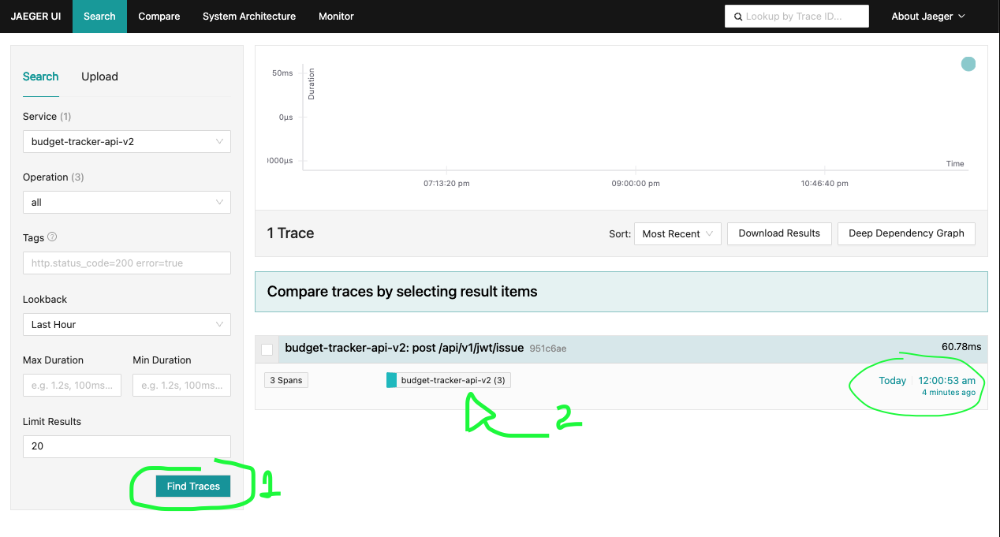
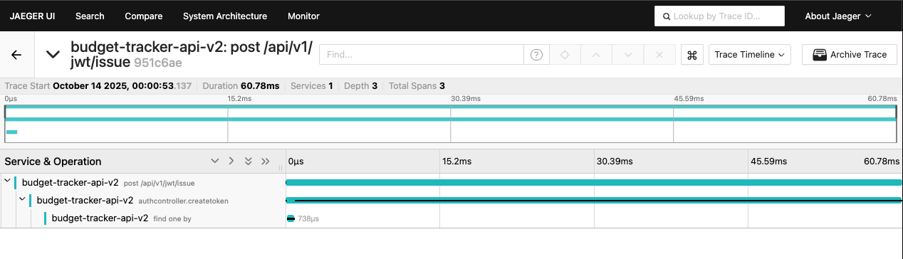
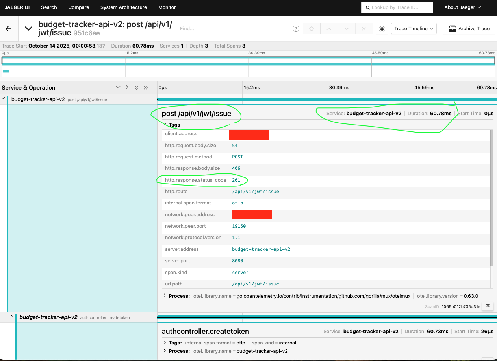
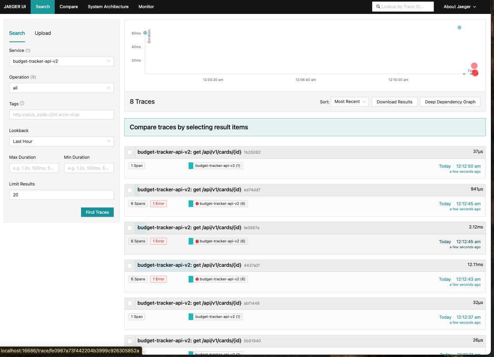

# Visualizing traces

By default, the application will forward all it's traces to an opentelemetry collector, which forwards traces to a local jaeger installation.

Both containers can be created through `docker-compose up -d`.

To access jaeger UI local container, simply access: [http://localhost:16686](http://localhost:16686){:target="_blank"}:

{ align="center" }

## Generating traces

Let's explore a new request and see it's flow through the traces. Let's say I have a valid user and I would like to generate a new token:

{ align="center" }

## Observing traces through Jaeger

Now that you completed the request and got a `201`, let's see how it ends up within our tracing-platform. Through Jaeger: go to the home page and click in `Find Traces` button.

{ align="center" }

{ align="center" }

{ align="center" }

This is how Jaeger will looks like after a few different requests:

{ align="center" }
